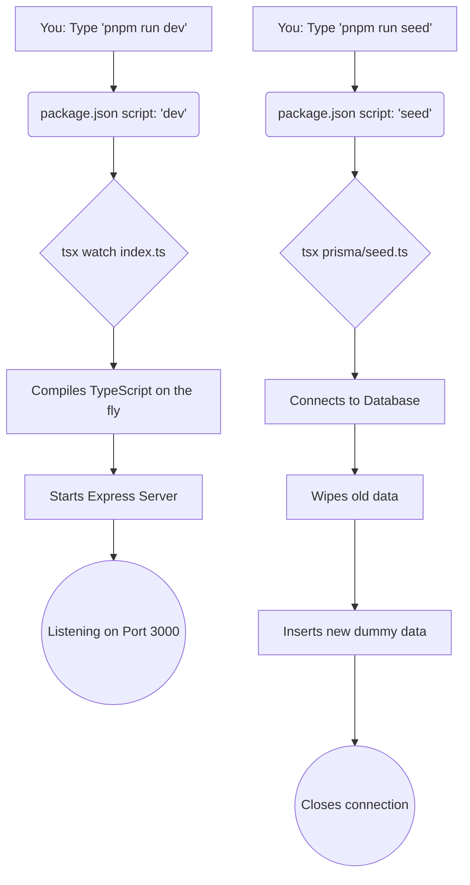
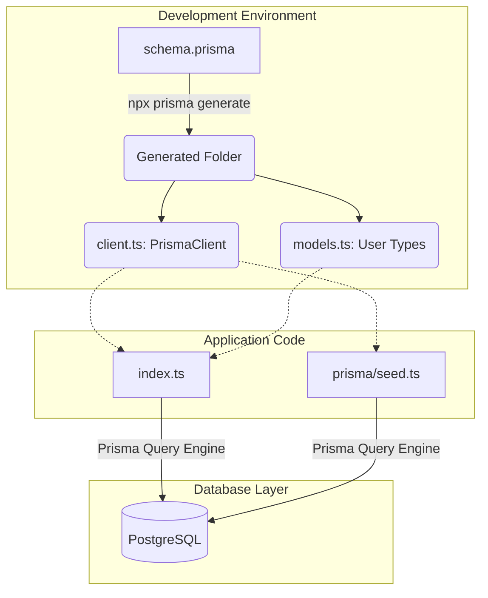

# 📚 Course Notes: Prisma & Express Masterclass

Welcome to class! Today, we're diving deep into the code we've written for our backend system using Node.js, Express, and Prisma. We'll explore each file, how they connect, and what the magic behind the scenes looks like.

## 1. 📝 The `package.json` Scripts: Your Command Center

In the `package.json`, we have two essential scripts that act as the starting points for our application.

```json
  "scripts": {
    "dev": "tsx watch index.ts",
    "seed": "tsx prisma/seed.ts"
  },
  "prisma": {
    "seed": "tsx prisma/seed.ts"
  }
```

### 🔍 Command Breakdown

- **`pnpm run dev`** (executes `tsx watch index.ts`):
  - **`tsx`**: This is a powerful TypeScript execution environment. It compiles and runs our TypeScript code on the fly without needing a separate, slow build step!
  - **`watch`**: This flag tells `tsx` to monitor our files for changes. Whenever you hit save, the server restarts automatically. It saves us a massive amount of time during development.
  - **`index.ts`**: The main entry point of our application.
- **`pnpm run seed`** (executes `tsx prisma/seed.ts`):
  - This command executes our database seeding script. The `prisma: { seed: ... }` block tells Prisma's CLI which command to run when we type `npx prisma db seed`.

### 🔄 Sequential Flow Diagram



---

## 2. 🚀 The Entry Point: `index.ts`

This file is the beating heart of our backend. It starts an Express web server and connects it to our PostgreSQL database via Prisma.

### Code Breakdown

1.  **Imports and Environment Setup**:
    We bring in `express`, our custom `PrismaClient` (from the `generated` folder), and our database drivers (`pg` and `adapter-pg`).
    `dotenv.config()` loads our database connection string from the `.env` file securely into memory.
2.  **Prisma Initialization**:
    We create a connection pool (`new Pool()`) and wrap it in a Prisma adapter. This specific setup allows Prisma to communicate efficiently with serverless Postgres providers (like Neon). Finally, we instantiate `new PrismaClient({ adapter })`.
3.  **Express Server Setup**:
    `const app = express()` creates our server instance. `app.use(express.json())` is a middleware that allows our server to read incoming JSON data in request bodies.
4.  **The API Routes (Endpoints)**:
    - `GET /`: A simple health-check route to ensure the server is alive.
    - `GET /users`: Fetches users from specific countries (Canada, Australia, Ireland) using Prisma's `findMany()` combined with the `in` filter.
    - `PUT /user`: Updates all 25-year-old users, setting their age to 26 using `updateMany()`.
    - `DELETE /user`: Removes all users strictly older than 30 using `deleteMany()` with the `gt` (greater than) operator.
5.  **Starting the Engine**:
    `app.listen(port, ...)` tells the server to wake up and listen for incoming HTTP traffic on port 3000.

---

## 3. 🌱 The Seeder: `prisma/seed.ts`

When we need dummy data to test our API, we run this script. It directly populates our database.

### Code Breakdown

1.  **Database Connection**:
    Just like in `index.ts`, we connect to the database using the same connection pool and adapter setup to establish a direct pipeline to Postgres.
2.  **The `seed()` Function**:
    - `await prisma.user.deleteMany()`: We first clean the slate. This makes the script "idempotent" (safe to run multiple times), preventing duplicate data errors or unique constraint violations.
    - `await prisma.user.createMany({ data: [...] })`: We insert an array of 12 user objects into the database in one single, efficient query.
3.  **Execution and Cleanup**:
    `seed().then(() => prisma.$disconnect())` runs our async function and ensures that once it finishes successfully, we close the database connection gracefully. Leaving connections hanging can crash your database!

---

## 4. 🪄 The Magic: Generated Files (`generated/`)

When you run `npx prisma generate`, Prisma reads your `schema.prisma` and creates a fully typed, customized database client just for you. Because we specified `output = "../generated"` in the schema, it was placed in this folder instead of the default `node_modules`.

### What's inside the `generated/` folder?

- **`client.ts` / `browser.ts`**: These are the main entry files that export the actual `PrismaClient` class. This class is tailored specifically to your schema; it explicitly knows about the `User` model and its specific fields.
- **`models/` & `models.ts`**: Contains the TypeScript types and interfaces for your models. This is what gives you magical auto-complete in your code editor when you type `prisma.user.`.
- **`enums.ts`**: Contains any enums defined in your schema.
- **`commonInputTypes.ts`**: Contains all the complex underlying types needed for Prisma queries (e.g., defining the exact shape of a `where` clause for a User).
- **`internal/`**: Contains core Prisma query engine logic that handles the heavy lifting of translating your TypeScript function calls into raw SQL.

### System Architecture Diagram


